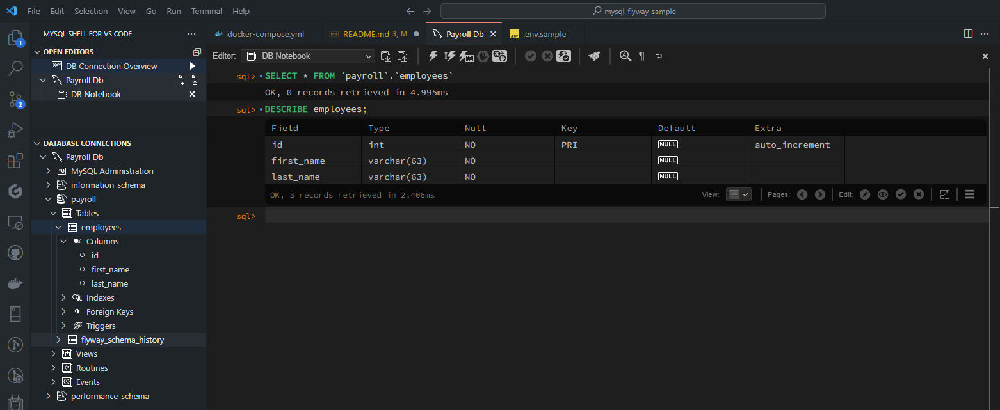

# MySQL Migration Using Flyway

## Introduction

Flyway is an open-source database migration tool that helps you automate and manage your database migrations. It is a lightweight and easy-to-use tool that works with plain SQL scripts. Flyway is available for multiple databases including MySQL, PostgreSQL, Oracle, SQL Server, and many more.

## Files

```sh
$ tree -a -P '.env.sample|.gitignore|*' -I '.git' -L 3
.
|-- .env
|-- .env.sample        
|-- .gitignore
|-- README.md
|-- docker-compose.yml 
|-- flyway
|   `-- conf
|       `-- flyway.conf
|-- migrations
`-- my.cnf

3 directories, 7 files 
```

Summary

- **.env.sample**: Template for .env (non-sensitive).
- **.gitignore**: Specifies files/directories to ignore in Git.
- **README.md**: Project overview and instructions.
- **docker-compose.yml**: Docker Compose configuration.
- **my.cnf**: MySQL server configuration.

Create your own `.env` with the values from the sample file.

## Run the services

```sh
$ docker compose up -d
time="2024-09-23T14:26:38+08:00" level=warning msg="Found orphan containers ([mysql-flyway-sample-flyway-run-32433b6f04b3]) for this project. If you removed or renamed this service in your compose file, you can run this command with the --remove-orphans flag to clean it up."
[+] Running 2/2
 ✔ Container payroll_db  Running                                                      0.0s 
 ✔ Container flyway      Started                                                      0.5s                                                                                                                               0.4s 
```


Sample logs

```sh
2024-09-23 14:26:41 See release notes here: https://rd.gt/416ObMi
2024-09-23 14:26:41 Database: jdbc:mysql://db:3306/payroll (MySQL 8.0)
2024-09-23 14:26:41 Successfully validated 0 migrations (execution time 00:00.026s)
2024-09-23 14:26:41 WARNING: No migrations found. Are your locations set up correctly?
2024-09-23 14:26:41 Current version of schema `payroll`: << Empty Schema >>
2024-09-23 14:26:41 Schema `payroll` is up to date. No migration necessary.
```

When the migrations folder is empty.

To prevent the container from exiting we replaced

```yml
    command: -configFiles=/flyway/conf/flyway.conf migrate
```

with

```yml
    entrypoint: ['/flyway/entrypoint.sh']
```

The `entrypoint.sh` script

```sh
#!/bin/sh
# entrypoint.sh

# Keep the container running
tail -f /dev/null
```

Keeps the container running indefinitely.

We can now call the Flyway CLI from the host machine.

```sh
# Start the containers
docker-compose up -d

# List migrations
docker exec -it flyway flyway info

# Apply migrations
docker exec -it flyway flyway migrate

# Validate migrations
docker exec -it flyway flyway validate
```

Sample output

```sh
$ docker exec -it flyway flyway info
Flyway OSS Edition 10.18.0 by Redgate

See release notes here: https://rd.gt/416ObMi
Database: jdbc:mysql://db:3306/payroll (MySQL 8.0)
Schema version: << Empty Schema >>

+----------+---------+-------------+------+--------------+-------+----------+
| Category | Version | Description | Type | Installed On | State | Undoable |
+----------+---------+-------------+------+--------------+-------+----------+
| No migrations found                                                       |
+----------+---------+-------------+------+--------------+-------+----------+


What's next:
    Try Docker Debug for seamless, persistent debugging tools in any container or image → docker debug flyway
    Learn more at https://docs.docker.com/go/debug-cli/
```

## Add an SQL migration script

Create a new SQL migration script in the `migrations` folder.

```sh
$ touch migrations/V1__create_employee_table.sql
# $ touch migrations/V0000001__create_employee_table.sql # we can also left pad or prefix the version with zeros
# the version number should be unique and separated by two underscores from the description
```

We can check the status of the migrations.

```sh
$ docker exec -it flyway flyway info
Flyway OSS Edition 10.18.0 by Redgate

See release notes here: https://rd.gt/416ObMi
Database: jdbc:mysql://db:3306/payroll (MySQL 8.0)
Schema version: << Empty Schema >>

+-----------+---------+-------------------------+------+--------------+---------+----------+
| Category  | Version | Description             | Type | Installed On | State   | Undoable |
+-----------+---------+-------------------------+------+--------------+---------+----------+
| Versioned | 000001  |  create employees table | SQL  |              | Pending | No       |
+-----------+---------+-------------------------+------+--------------+---------+----------+
```

It detected the new migration script. But knows that it hasn't yet been applied and is thus in a pending state.

Run the migrate command to apply the migration.

```sh
$ docker exec -it flyway flyway migrate
Flyway OSS Edition 10.18.0 by Redgate

See release notes here: https://rd.gt/416ObMi
Database: jdbc:mysql://db:3306/payroll (MySQL 8.0)
Successfully validated 1 migration (execution time 00:00.046s)
Current version of schema `payroll`: << Empty Schema >>
Migrating schema `payroll` to version "000001 -  create employees table"
Successfully applied 1 migration to schema `payroll`, now at version v000001 (execution time 00:00.210s)
```



The migration script has been applied successfully.

| Field          | Value                                |
|----------------|--------------------------------------|
| installed_rank | 1                                    |
| version        | 000001                               |
| description    | create employees table               |
| type           | SQL                                  |
| script         | V000001___create_employees_table.sql |
| checksum       | -514591778                           |
| installed_by   | payroll_admin                        |
| installed_on   | 2024-09-23 07:41:33                  |
| execution_time | 210                                  |
| success        | 1                                    |

## References

[Flyway Open Source Docker images](https://github.com/flyway/flyway-docker)

[MySQL Continuous Database Delivery with Flyway | Pluralsight](https://www.pluralsight.com/courses/mysql-flyway-continuous-database-delivery)
